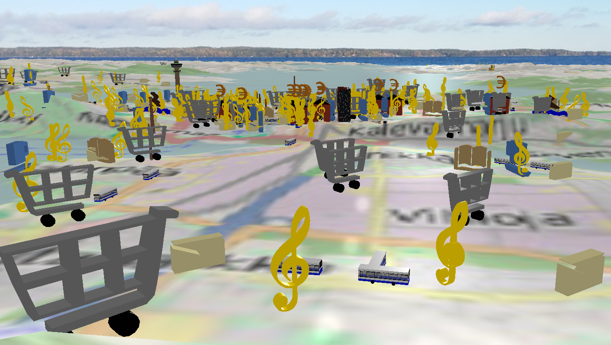

# Tampere Liki 3D

This 3D map application is used for collecting feedback from elderly people about possibilities to create applications
based on open data. The ideator Marko Suvila does this in the [Likioma-project](http://likioma.fi/).

The application visualizes open data that is interesting for the elderly people from Tampere, Finland and from the nearby
municipalities. The open data includes cafeterias, libraries, banks, mail boxes, post offices, swimming halls, pharmacies,
restaurants, groceries, convenience stores, and also busses in their actual locations ([more information](http://wiki.itsfactory.fi/index.php/Main_Page)),
[Teosto](https://www.teosto.fi/en) ([API](http://api.teosto.fi/)) venues as well as locations of the many
[VisitTampere](http://visittampere.fi/) ([API](http://visittampere.fi/api-docs/#!/default/search_get)) locations. Screenshot of the map below.

The application also visualizes real-time traffic light data of one junction at Tampere. The second sheet of the application has
3D map of this junction and it contains 8 vehicle traffic lights and 7 pedestrian traffic lights. The data from the traffic light
server is obtained once per second and the traffic lights at the map are updated based on the state provided in the received data.
Though this traffic light data and the visualization is not only for elderly people they do still drive and walk in the city and
they may have useful information and ideas how the traffic light data could be utilized.

You can see the application running at the http://liki3d.herokuapp.com/ page. The application visualizes the
information mainly as 3D icons on the map. The icons can be obtained from http://liki3d.herokuapp.com/3d/models.html or via cloning this
repository and use them under <a href="https://creativecommons.org/licenses/by/4.0/deed.en" target="_blank">CC-BY 4.0 -license</a>.
